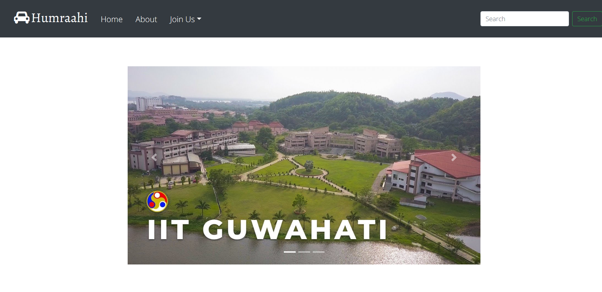
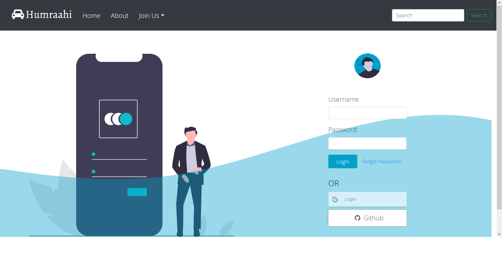
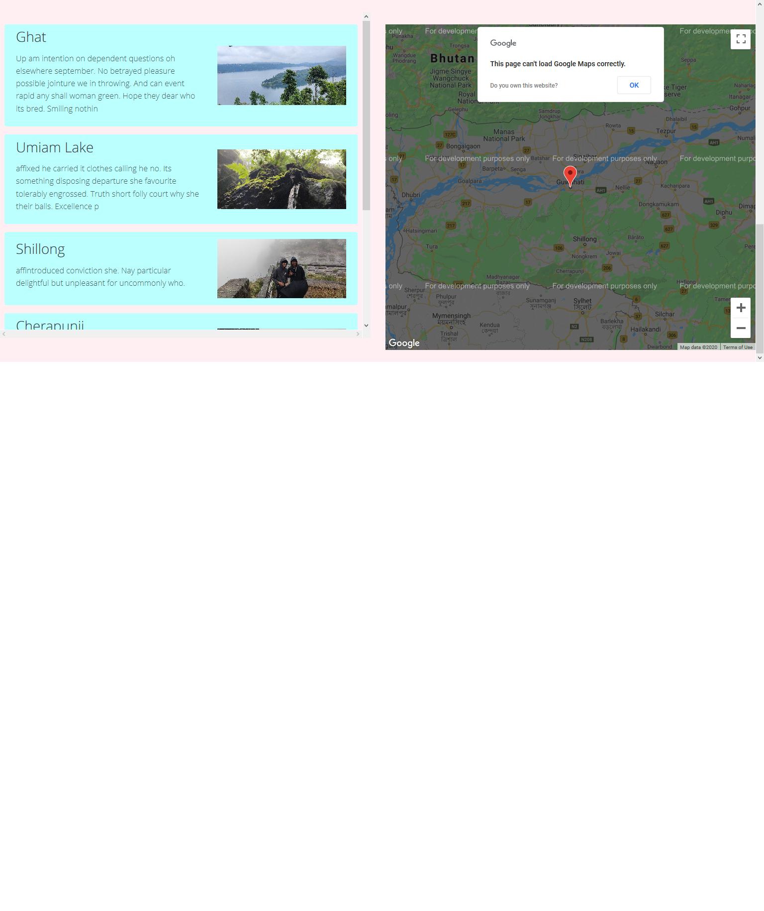
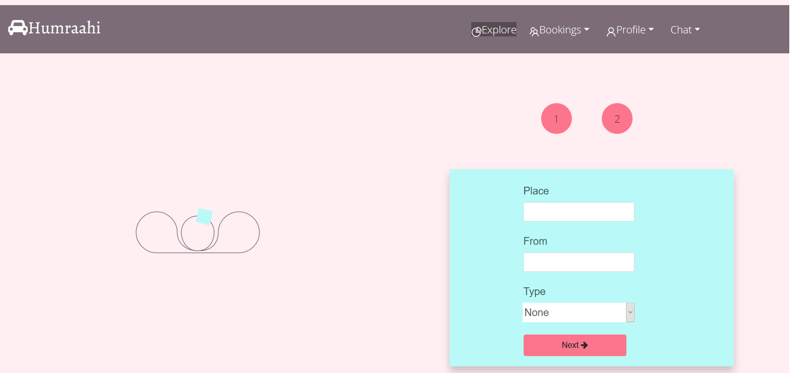
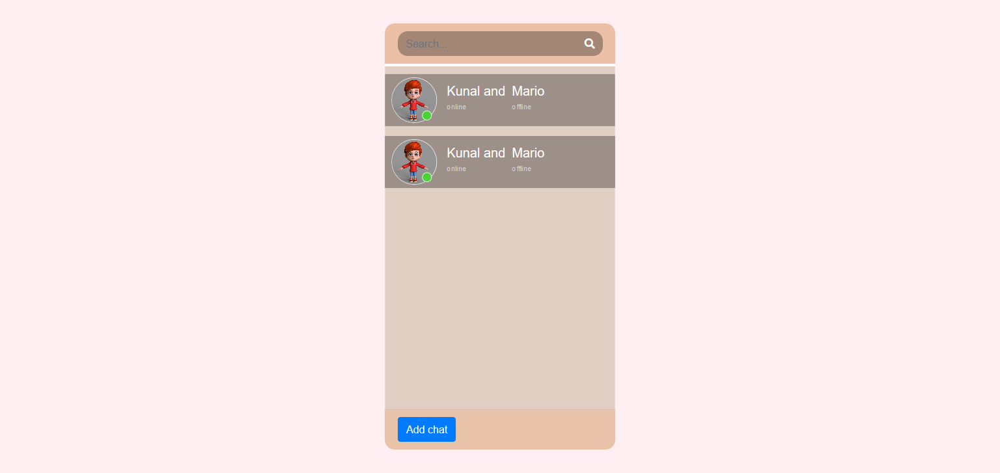
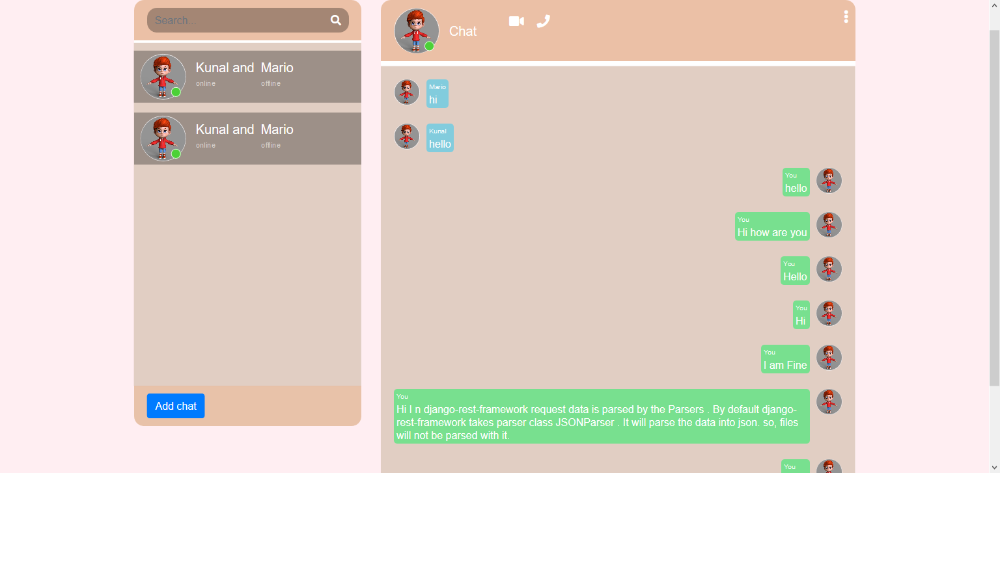
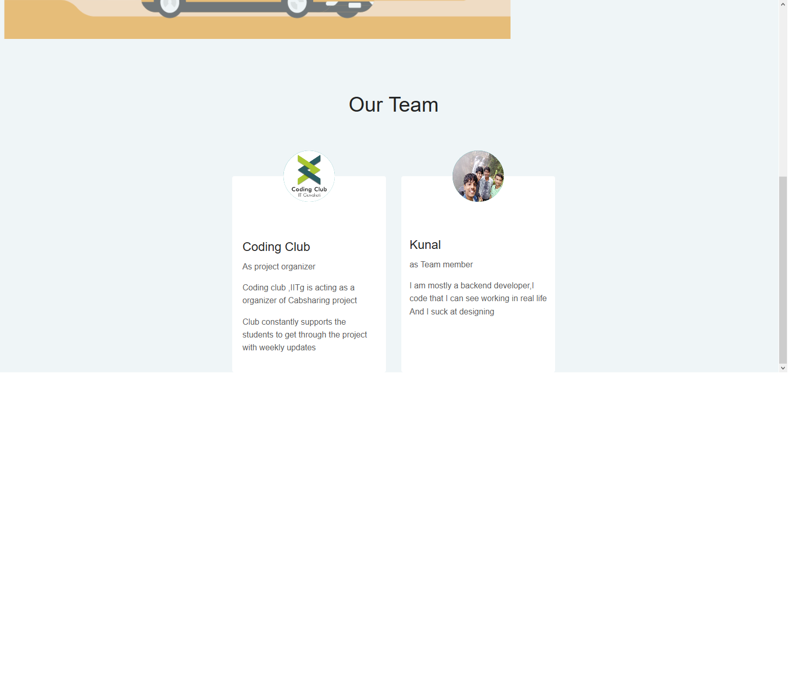
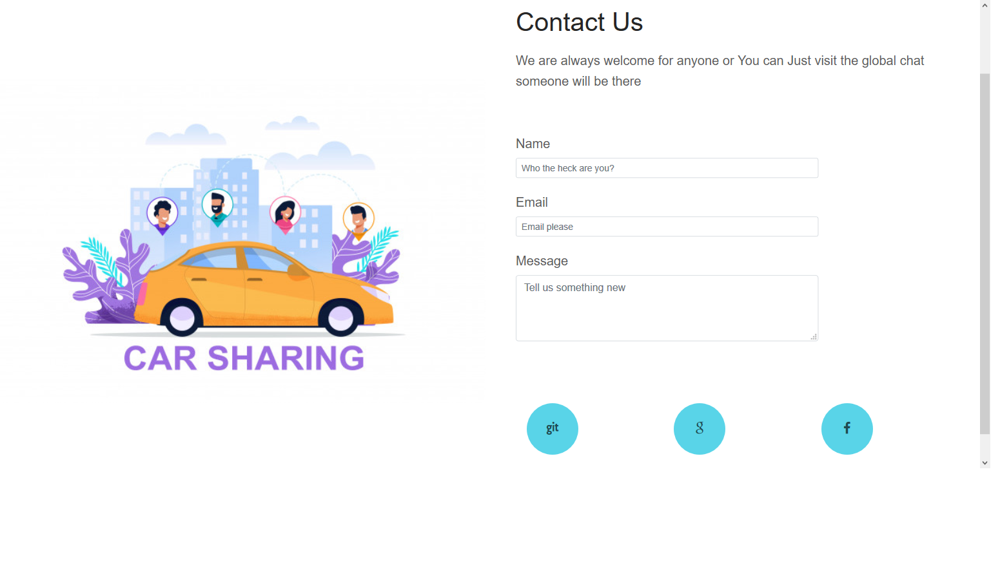

# Cabsharing

Humraahi - Makes travelling fun.

 
</img>

<strong>Humraahi</strong> is a Cab sharing Website for IIT-G Campus.  

# Techstack
  1. Frontend 
      - React 
      - React-redux 
      - antd and bootstrap
      - React router dom 
      - animes.js (a bit )
      - react-github/google-login

  2. Backend 
       - Django 
       - Django-rest framework 
       - allauth
       - rest-auth
       - django-channels
   
   
   

# Install .
Getting the frontend build:
 - npm install 
 - npm run build

Backend 
  - pip install -r requirements.txt  
  or downloading according to your environment .Make sure you have redis-cli insalled locally or globally and add it to path variables
  - cd into project dir
  - redis-server (from differnt terminal)
  - python manage.py collectstatic 
  - python manage.py runserver

  You can use react's 3000 as your development server . ALso you need to take care of your environment varialbles like github secret and google api secret and emailing backends.Also change the database settings according to your choice.
   

  

# Features 
   1. Realtime chat 
   2. Realtime notifications of match
   3. Booking and cancelling a ride anytime .
   4. Groups already matched can be joined .
   5. And most other features of a basic site .  
      
     Profile update 
              Change password  
              Reset password with email(current not customized)
               
              Goggle and Github Login
      

   Matched booking will be shown which are going to same place and from same place ,at exact same date with time diff of +-3 hours .
   Facebook Login is not in place, as I faced issues while implementing it with rest framework.

# Todo 
   1. Profile :  updating the profile pic .
       
     Either a sperate profile serializer need to be made or update existing one to parse file uploads
      

  2. Deleting chats 
  
  3. Allowing to choose no of members for more than 4 member in group(not so immediate change)

  4. Aws deploy ??
      - The site is currently running on heroku at -
<a href="https://humraahi-iitg.herokuapp.com/">https://humraahi-iitg.herokuapp.com/</a>
But It has problems . As it turns out ,heroku needs credit card for more than one addons .So redis instance is not made which makes the notifications and chat features === NULL.

      - Some functionalities might be down on heroku deploy like
          1. redis-server is not added as heroku requires to add credit card to add two or more addons.

5. Adding map 
   - Google apis need card too.I found another service but didnt get time to add it.

# Gallery .
Home page
  
User Login 

User SignUp

UserDashboard

Booking ride

Profile

chat

contact 

