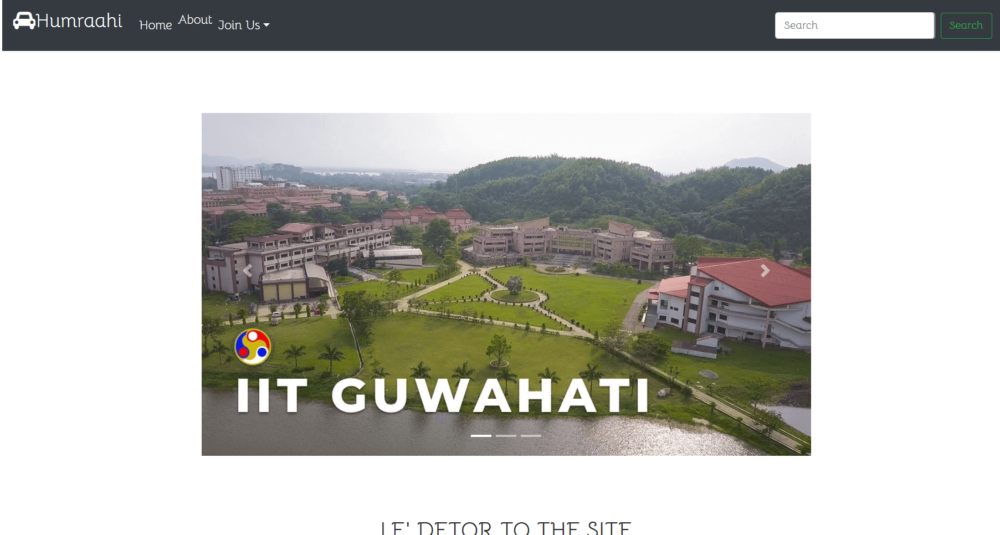

# Cabsharing

Humraahi - Makes travelling fun.

 

</img>

Humraahi is a Cab sharing Website for IIT-G Campus.

# Techstack
  1. Frontend 
      - React 
      - React-redux 
      - antd and bootstrap
      - React router dom 
      - animes.js (a bit )

  2. Backend 
       - Django 
       - Django-rest framework 
       - allauth
       - rest-auth
       - django-channels

# Install .
Getting the frontend running
 - npm install 
 - npm run build

Backend 
  - pip install -r requirements.txt  
  or downloading according to your environment .Make sure you have redis-cli insalled locally or globally and add it to path variables
  - cd into project dir
  - redis-server (from differnt terminal)
  - python manage.py collectstatic 
  - python manage.py runserver

  You can use react's 3000 as your development server . ALso you need to take care of your environment varialbles .Like github secret and google api secret and emailing backends.Also the change database settings according to your choice.
   

  

# Features 
   1. Realtime chat 
   2. Realtime notifications of match
   3. Booking and cancelling a ride anytime .
   4. Groups already matched can be joined .
   5. And most other features of a basic site .  
      
     Profile update 
              Change password  
              Reset password with email(current not customized)
               
              Goggle and Github Login
      

   Match will be shown which are going to same lace and from same place at exact same date with time diff of +-3 hours .
   Facebbok Login is not in place as I faced issues while implementing it with rest framework.

# Screenshots .
Home page
  

# Todo 
   1. Profile updating the profile pic .
       
     Either a sperate profile serializer need to be made or update existing one to parse file uploads
      

  2. Deleting chats 
  
  3. Allowing to choose member in group(not so immediate change)

